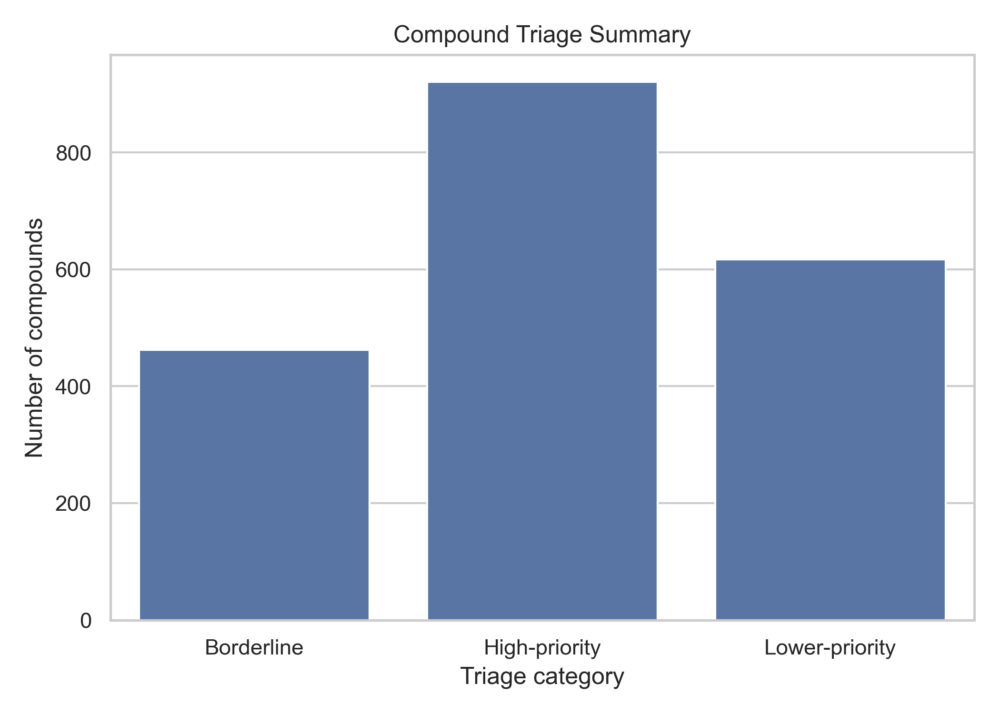
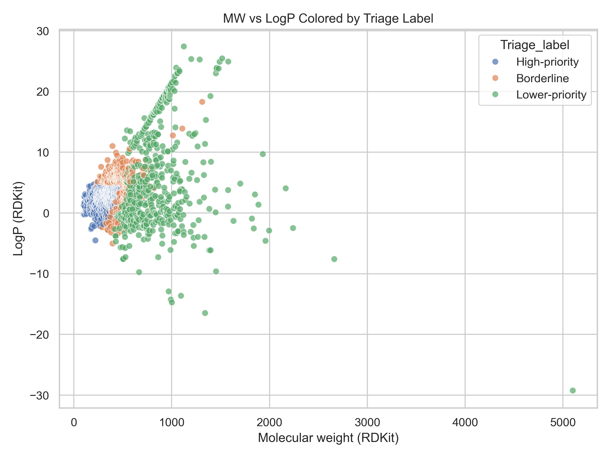

<p align="center">
  
  
  
</p>

# Drug-Likeness and ADME Screener

A cheminformatics workflow for prioritizing natural products using physicochemical and oral drug-likeness heuristics. This project applies interpretable rule-based screening to a 2,000-compound descriptor set in order to identify compounds that appear more suitable for early-stage small-molecule prioritization.

## Executive Summary

This project demonstrates practical computational skills relevant to medicinal chemistry, pharmaceutical research, and data-driven compound evaluation. Using RDKit-derived descriptors, compounds were screened with Lipinski-style and Veber-style criteria, ranked by rule performance, and organized into decision-ready triage categories.

The workflow addresses a common early-discovery problem: narrowing a large and chemically diverse compound set into a smaller subset that is more actionable for downstream evaluation. Rather than treating descriptors as isolated values, the analysis uses them to support a clear prioritization task.

## Key Outcomes

- Built a reproducible Python workflow for descriptor-based compound triage.
- Screened 2,000 natural products using RDKit-derived physicochemical properties.
- Identified 1,157 compounds that satisfied both Lipinski-style and Veber-style criteria.
- Generated ranked output tables and visual summaries for rapid interpretation.
- Organized the project into a clear GitHub-ready structure with notebook, processed data, and results figures.

## Scientific Context

Natural products remain a major source of structurally diverse bioactive molecules, but many occupy physicochemical space that can complicate oral drug development. Rule-based screening provides a fast first-pass method for identifying compounds that more closely align with commonly used medicinal chemistry heuristics.

This type of workflow is useful for early prioritization, lead-selection support, and exploratory compound profiling. It also provides a foundation for future extensions such as clustering, similarity analysis, structural alert filtering, or predictive modeling.

## Input Features

The analysis used a descriptor table containing the following RDKit-derived properties:

- Molecular weight (`MolWt_rdkit`)
- LogP (`LogP_rdkit`)
- Topological polar surface area (`TPSA_rdkit`)
- Hydrogen bond donors (`HDonors_rdkit`)
- Hydrogen bond acceptors (`HAcceptors_rdkit`)
- Rotatable bonds (`RotBonds_rdkit`)

These descriptors were used to support rule-based screening and triage labeling.

## Screening Framework

### Lipinski-style filter

Compounds were evaluated against the following thresholds:

- Molecular weight <= 500
- LogP <= 5
- Hydrogen bond donors <= 5
- Hydrogen bond acceptors <= 10

Compounds with no more than one violation were classified as passing the Lipinski-style screen.

### Veber-style filter

Compounds were also evaluated using:

- Rotatable bonds <= 10
- TPSA <= 140

Compounds satisfying both criteria were classified as passing the Veber-style screen.

### Triage Logic

Compounds were assigned to three categories:

- **High-priority** — passed both filters with zero Lipinski violations
- **Borderline** — passed at least one major filter but did not meet the highest-priority standard
- **Lower-priority** — failed both filters or displayed less favorable rule-based profiles

## Results

### Screening Summary

| Metric | Count |
|---|---:|
| Total compounds screened | 2000 |
| Passed Lipinski-style filter | 1314 |
| Passed Veber-style filter | 1226 |
| Passed both filters | 1157 |
| High-priority compounds | 921 |
| Borderline compounds | 462 |
| Lower-priority compounds | 617 |

These results indicate that a substantial subset of the screened natural products falls within commonly used oral drug-likeness heuristics, while also highlighting compounds that may require deprioritization or later structural optimization.

## Repository Structure

```text
drug-likeness-adme-screener/
├── README.md
├── drug_likeness_screening.ipynb
└── data/
    ├── processed/
    │   ├── screened_compounds.csv
    │   └── top_hits.csv
    └── results/
        ├── triage_counts.png
        └── mw_vs_logp_triage.png
```

## Visual Outputs

### Triage counts



### Molecular weight vs LogP



## Technical Skills Demonstrated

- Python data analysis with pandas
- RDKit-based descriptor interpretation
- Rule-based compound prioritization
- Data visualization with matplotlib and seaborn
- Scientific workflow organization for reproducible portfolio projects

## Limitations

This workflow is intended for early-stage prioritization and does not replace experimental ADME testing, permeability studies, metabolic stability assays, or higher-complexity predictive pharmacokinetic models. In addition, natural products often extend beyond classical oral drug-likeness space, so compounds flagged as lower-priority may still retain biological or lead-optimization value.

## Future Extensions

Potential next steps include:

- incorporating PAINS or structural alert filters
- adding structural similarity search
- clustering prioritized compounds by descriptor space
- expanding the workflow into an interactive dashboard
- comparing subsets across natural product classes or source organisms

## Author

**Ava Richards**  
Biomedical Science graduate with interests in medicinal chemistry, natural-product drug discovery, and computational analysis.
